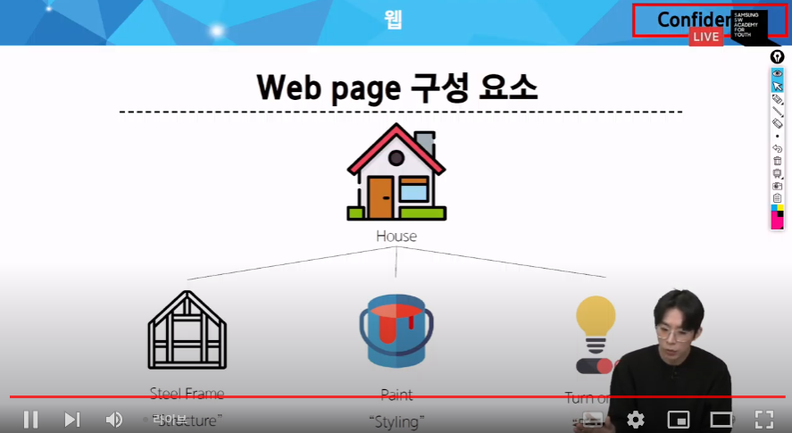
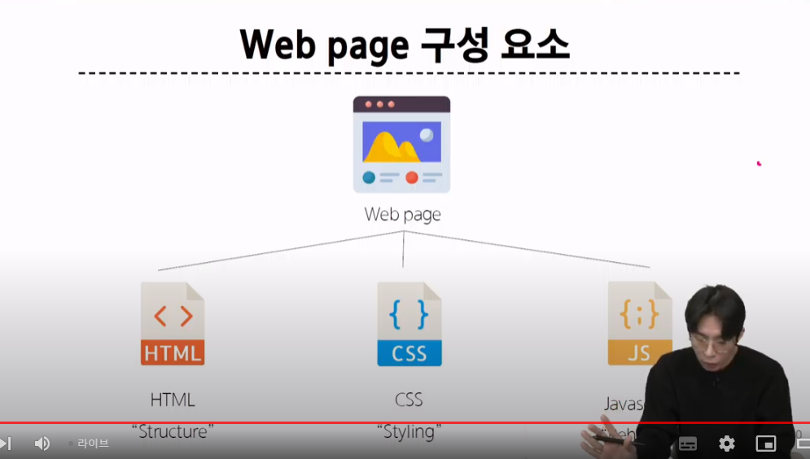
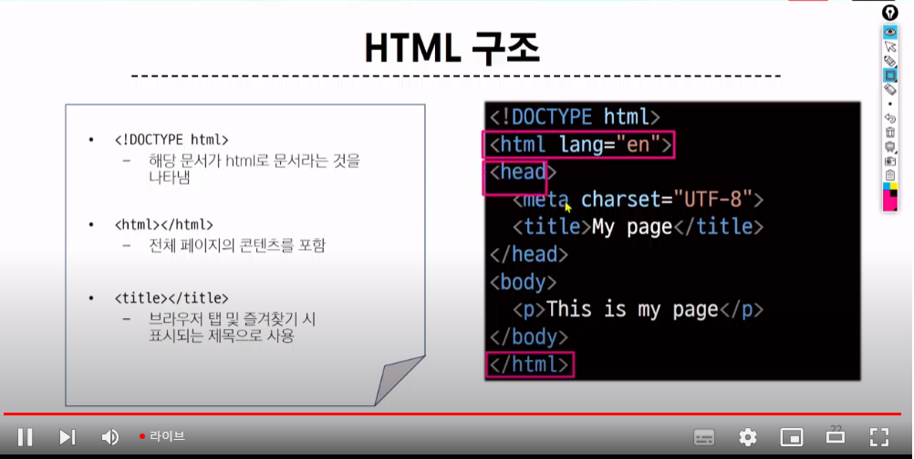
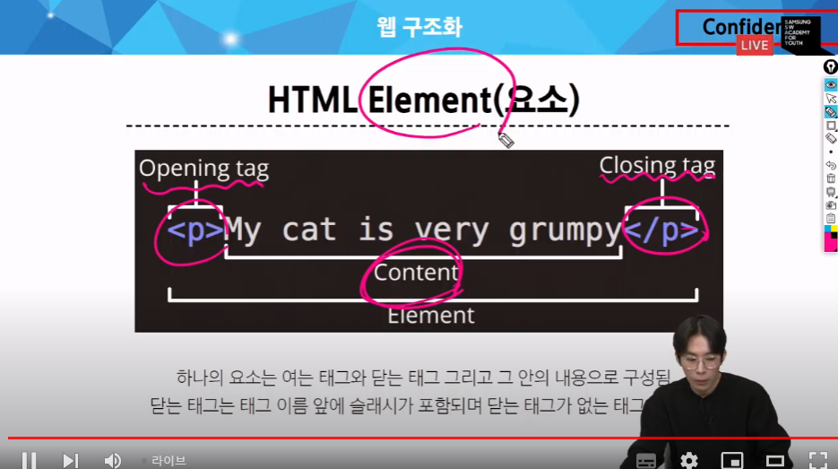
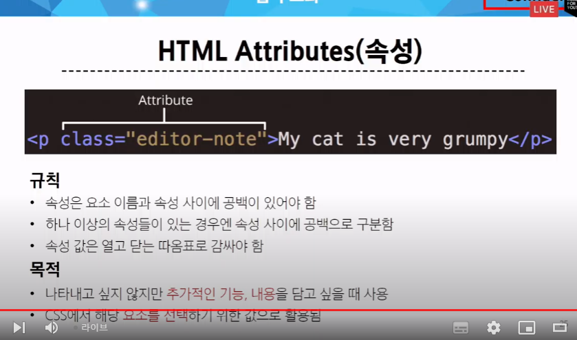
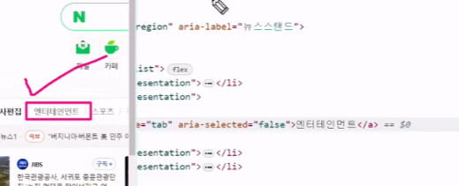
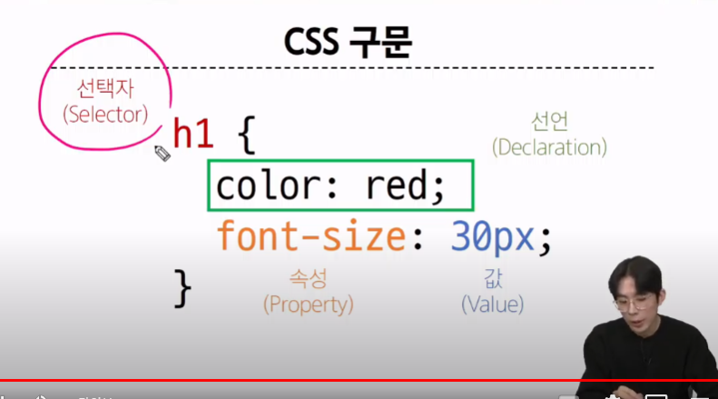
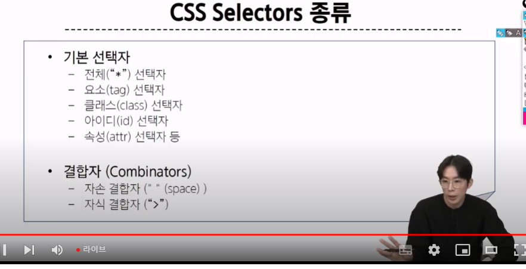
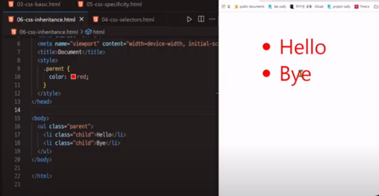
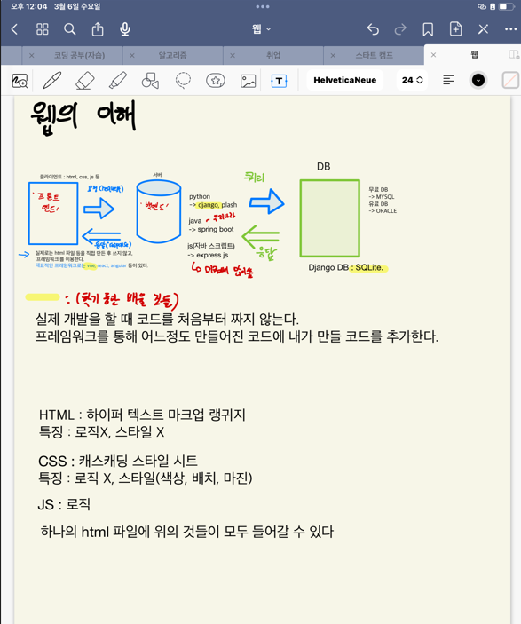

# HTML&CSS

https://www.youtube.com/watch?v=Gcm-ekgvsV0

## 1. 웹

World Wide Web

### 1) Web

Web site, Web application 등을 통해 사용자들이 정보를 검색하고 상호작용하는 기술

- Web site : 인터넷에서 여러개의 Web page가 모인 것. 사용자들에게 정보나 서비스를 제공하는 공간
    - Web page: HTML,CSS 등의 웹 기술을 이용하여 만들어진, Web site를 구성하는 하나의 요소(네이버 등은 하나의 웹 페이지가 아니라 여러 웹페이지의 집합)
        - 구성요소 :HTML(철골), CSS(페인트), JS(행위 ex: 불 켜기)
    

< 웹 페이지의 구성 요소>





### 2) 웹 구조화 (HTML)

- HTML: HyperText Markup Language : 웹 페이지의 *의미*와 *구조*를 정의하는 언어

    - Hypertext : 링크. 웹페이지를 다른 페이지로 연결하는 링크. 참조를 통해 사용자가 한 문서에서 다른 문서로 즉시 접근할 수 있는 텍스트
        - 장점: 만약 이게 없다면 이전 페이지, 다음 페이지의 선형 구조에서밖에 확인이 불가능했음.
    
    - Markup(구조화) Language :태그 등을 이용하여 문서나 데이터의 구조를 명시하는 언어 ex) HTML, MD
        - 이 HTML 구조를 해석해주는 애가 *브라우저*(크롬,파이어폭스...)
    
< HTML의 구조 >




/ : 먼저 <html>로 열고, </html>로 닫는다.

<head> </head> -> 문서에 대한 설정. 사용자에게 보이지 않는다. 

브라우저에서 ctrl shift i 누르면 개발자모드


< HTML 요소 >



주의 : 닫는 태그가 없는 태그도 존재

< HTML 속서>

- 여는 태그에 작성




#### 실습 확인

alt b -> vscode에서 바로 브라우저 열기



'엔터'를 클릭하면 들어가는걸 '엔터테인먼트'로 변경할 수 있음

! 하고 엔터 누르면 세팅 바로 끝남

### CSS (페인트)
Cascading Style Sheet : 웹페이지의 *디자인*과 *레이아웃*을 구성하는 언어 -> 배치가 가능

#### < CSS 구문 >


- 선택자
- 선언
    - 속성
    - 값
    
선택자 {
    속성:값;
}

css가 어려운 점? 속성이 무수히 많다

주의 : 선언이 끝날 때마다 세미콜론 ;을 붙여야 한다.

#### CSS 적용 방법

실습 3번 확인


#### 선택자 -> CSS에서 가장 중요한 것



- 기본 선택자
- 결합자

- 아이디와 클래스로 속성을 입힐 때는 아이디가 우선순위가 더 높다.
- 자주 사용할거면 클래스를 이용해라

### 명시도

결과적으로 요소에 적용할 css 선언을 결정하기 위한 알고리즘

전체선택자<요소선택자

동일한 요소에 여러번 선택자가 입력되면 해당 선택자들끼리 비교가중치를 통해서 결정됨

만약 선택자의 우선순위가 같다면 마지막에 나오는 선언이 사용됨(계단식)

>선택자 :  id>class>요소

27m

### CSS 상속

- 상속 되는 속성
    - Text 관련 요소(font,color...)
    
- 상속 x
    - 배치 등
    



# OffLine

웹페이지에 보이는 것들(사이트에서 보이는거)가 클라이언트, 클라이언트: html,css,js

프레임워크 : 미리 짜여진 소스코드 -> 이미 짜여진 소스코드를 사용 가능(백엔드?), 회사마다 쓰는 프레임워크가 다르다. vue,react,angular, python으로 이뤄진건 django,plask, java는 spring boot, js는 express js (미국에서 많이 씀)

HTML : 하이퍼 텍스트 마크업 랭귀지, 로직x, 스타일 x, 뼈대만 표현 

CSS: 캐스캐딩 스타일 시트, 스타일(색상,배치,마진), 로직x

JS: 로직

역할은 구분되도 파일이 구분되는건 x. 하나의 HTML 파일에 CSS와 JS를 넣을 수 있음

> 우리의 궁극적인 목적은 프레임워크를 잘 다룰 수 있게 하는 것



### . 
웹페이지는 크게 3가지 영역으로 나눌 수 있다.

위에서부터 header, main, footer

- main은 추가적으로 섹션들로 나눌 수 있고, 거기에 더해 side bar가 존재한다. 


live server을 extension으로 깔아라


****우선순위
1. !important
2. inline style
3. id 선택자 > class 선택자
**4. 태그끼리는 순서상 마지막이 우선순위가 높다 
   
명령어:
```html

input#user_id


```