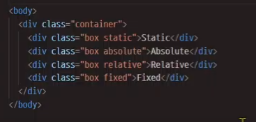
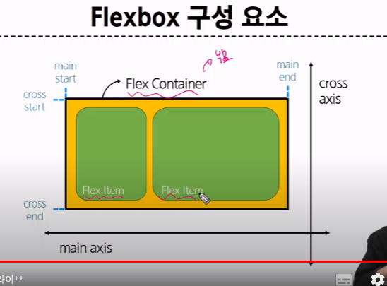

## CSS BOX Model

원은 네모 박스를 깎은 것이다 -> 실제로 차지하는 공간은 원만큼이 아닌, 사각형 형태임 => 이걸 배치 공부할 때 염두에 둬야함

### 구성 요소

- 내용, 안쪽 여백(Padding),테두리(border),외부 간격(margin)


이 4가지 영역을 통해 박스의 크기, 여백, 다른 박스와의 간격 등을 조정한다.

특징? 각각 방향이 존재한다. 각각 4개씩


컨텐츠는 width와 height로 나뉨.

<width 주의점>

width의 기준은 우리가 생각하는 박스 사이즈(테두리)가 아니라, content

그럼 기준 바꾸려면?


> 테두리 두께도 고려해야한다


그래서 이게 너무 고려할게 많으니깐, box-sizing : border-box; 등 우리가 원하는 형태로 바꾸고 사용한다.

### 박스 타입

- Block : 막는 박스
- inline : 넣는 박스

-> 흐름의 방향이 좌우인지, 위아래인지에 따라 나뉨

> block -> 해당 높이에 있는 자리는 모두 자기 자리


#### inline 특징

- 새로운 행으로 나뉘지 않음
- width와 height 속성을 사용할 수 없음
- 수직 방향
  - padding, margins,borders가 적용되지만 다른 요소를 _밀어낼 수는 없음_
- 수평방향
  - padding,margins,borders가 적용되어 다른 요소를 밀어낼 수 있음
- 대표적인 inline 타입 태그
  - a, img, span

> 주의 : 정렬을 하려면 정렬의 주체를 기준으로 생각하려 하지만, CSS에선 다른 부분을 고려하는게 더 좋다


ex) 컨텐츠를 오른쪽으로 옮기려면 옮기려는 요소를 컨트롤 하는게 아니라, 오른쪽 마진을 줄여서 왼쪽 마진을 늘리는 것.

### 다른 display

#### inline-block

인라인과 블락의 중간점.

- block 요소의 특징을 가짐
  - width 및 height 속성 사용 가능
  - padding, margin 및 border로 인해 다른 요소가 _밀려남_-> 기존 inline + block
- when? 요소가 줄바꿈 되는 것을 원하지 않으면서, 너비와 높이를 적요하고 싶을 때 사용

#### none

요소를 화면에 표시하지 않고, 공간도 없음

when? 작은 화면에서 큰 화면으로 바꾸는 등 ( 반응형 )에 활용

### 참고

#### shorthand 속성 - border

생략 표현이 가능

#### shorthand 속성 - margin & padding


4방향 - 상우하좌(시계)

3방향 - 상/좌우/하

2방향 - 상하/좌우

1개 - 공통

#### margin collapsing (마진 상쇄)

- 두 블럭타입의 margin이 겹치게 된다면 합이 아니라 _큰 쪽으로_ 판단됨


## CSS Position

### CSS Layout

각 요소의 *위치*와 *크기를 조정*하여 웹 페이지의 디자인을 결정하는 것

Display, Position, Float, Flexbox 등

#### CSS position

normal flow(해당 박스가 가진 디폴트 흐름 방향, css를 적용하지 않았을 경우 웹페이지 요소가 기본적으로 배치되는 방향)을 _제거하므로서_ 우리가 원하는 다른 위치로 배치하는 것


#### position 유형

1. static
2. relative
3. absolute
4. fixed
5. sticky


1. static

우리가 아예 값을 주지 않았을 떄의 기본값 -> 우리가 지금까지 쓰던거

2. relative - 상대 위치, 기준은? 본인 static 위치

top 100을 주면 위쪽에 100을 준다 -> content는 아래로 이동

본인의 원래 위치 기준으로 움직인다.

> 본인이 이동하더라도 기존 본인의 static은 그대로 차지하면서 유지.

3. absolute - 절대 위치

상대 위치와 다르게 본인의 static 자체를 움직임 => 움직이고 나면 본인의 과거 위치는 사라져버림 -> 그 빈자리는 다른 애가 차지하게 됨.

그래서 layout이 전체적으로 바뀌어서 깨질 가능성이 존재

그럼 뭘 기준으로 움직이냐?

> 기준점을 잡아야 한다(부모)
> static이 아닌 부모를 찾아서 기준으로 삼음. => 이 부모를 설정을 잘 해야함



부모를 따로 생성(container)

4. fixed

완전 고정, 뭐를 기준으로? _우리가 보는 화면_ 기준. 마치 웹툰 리모컨처럼.

스크롤을 내려도 그대로임


5. sticky

특정 위치까진 static과 같지만, _특정 임계점을 도달하면_ fixed처럼 작동

동일한 형식의 sticky가 있다면 대체됨

when? 쇼핑몰 카테고리 같은거


#### z-index

요소가 겹쳤을 때 어떤걸 위로 올릴지 지정 가능

다른 어떤 요소보다 위로 올라와야 하는 요소가 있다면 z-index : 9999;

### 참고

#### position 의 역할

*전체 페이지*에 대한 레이아웃을 구성하는 것이 아닌, *페이지 특정 항목의 위치를 조정*하는 것

전체 틀을 움직이려면 ? Flexbox

## **\*\*\*\***\***\*\*\*\***CSS Flexbox**\*\***\*\*\*\***\*\***\***\*\***\*\*\*\***\*\***

> html의 핵심은 flexbox와 반응형 웹

요소를 행과 열 형태로 배치하는 _1차원_ 레이아웃 방식

행렬 기준으로 여러개의 요소들을 한 번에 움직일 수 있음 != position

<구성요소>



- Flex Container - 부모 -> 정렬의 주체, 얘를 컨트롤
- Flex item - 자식
- main 축
- cross 축

디폴트 시작점은 좌측상단

#### 주 축

- flex item 들이 배치되는 기본 축
- 얘를 기본으로 정렬된다.
- 정렬방향을 바꿀 수 있음
- 메인 축을 상하 방향으로 흐르도록 만들 수도 있음

#### 교차 축

- main axis에 수직인 축

#### flex container

- 얘를 기준으로 움직인다.
- 이 안에 있는 요소들은 알아서 움직임
  > 주의: flex의 기본 방향은 수평방향이기 때문에 container 내부의 contents는 normal flow가 아닌 수평 방향으로 움직인다.


- 축의 방향을 조절하기 위해선 flex-direction : column을 사용하면 됨(기존은 flex-direction : row)
- 만약 방향은 그대로고, 순서를 반대로 바꾸고 싶다면 row-reverse나 column-reverse와 같이 reverse를 붙여주면 됨.

#### flex item

- containe 안에 있는 것

### 레이아웃 구성

4-1번 파일


<메인 축의 방향과 reverse>


3. flex wrap


만약 container의 크기가 요소들을 담기 충분하지 않을 정도로 브라우저가 작아졌을 때, 이를 다음 행에 배치할지의 여부를 표현


여기서


여기로.

4. justify-content : 메인축 기준


본격적인 배치 시작

- 주 축을 따라 flex item과 주위에 _공간을 분배_, item을 분배하는 것이 아님 -> 기존에 마진을 분배하던 것과 비슷.
- 마진을 기준으로 움직이는 것보다 훨씬 쉬움

> allign content는 수직축 기준

6. allign-items : 한 줄 정렬

한 줄 일 땐 이걸 이용 가능

> 만약 한 줄에 있는 컨텐츠가 따로 움직이고 싶으면? 유일하게 자식을 컨트롤 allign self


allign - self

<목적에 따른 속성 분류>


<속성명 Tip>


8. flex-grow

여백 처리


여백을 분배할 수 있다.


> 주의: 배수 단위가 아니라 그냥 등분한다 생각

9. flex-basis

# offline

## 1

### 1. 단위

1. 픽셀 : 화면에서 가장 기본 단위(작은 단위)
2. rem: 루트의 글꼴 크기, 1rem = 16px, when? 브라우저에 따라 눈으로 보이는 기본 글꼴 크기가 다르기에
3. em : 부모 요소의 글꼴 크기에 사애저인 크기 (부모 요소의 글꼴이 16px면, 1em = 16px)
4. % : 부모 요소의 크기의 상대적인 비율

```html
<!DOCTYPE html>
<html lang="en">
  <head>
    <meta charset="UTF-8" />
    <meta http-equiv="X-UA-Compatible" content="IE=edge" />
    <meta name="viewport" content="width=device-width, initial-scale=1.0" />
    <title>Document</title>
    <style>
      .box1 {
        width: 200px;
        여기서 width는 컨텐츠 영역의 너비
        padding-left: 25px;
        padding-bottom: 25px;
        margin-left: 25px;
        margin-top: 50px;

        테두리 두께
        border-width: 3px;

        solid(실선), dotted(점선), dashed(짧은 직선)
        border-style: solid;
        border-color: black;

        추가) 둥근 테두리
        border-radius: 50; # 타원
      }


      .box2 {
        /* 단축형태 */

        width: 200px;

        <암기>
        4개: 상후하좌
        3개: 상/좌우/하
        2개: 상하/좌우
        1개: 공통

        /* 상하가 25, 좌우가 50 */
        padding: 25px 50px;

        /* 상하가 25 좌우가 auto */
        margin: 25px auto; # auto -> 가운데 정렬이 된다. (이건 좌우가 가운데 정렬, 상하는 25px씩)
          auto : 좌우여백을 자동으로 조정한다 -> 가운데 정렬

        border: 1px dashed black;
      }

      /* width(너비)를 똑같이 줬는데, box2가 더 길어보임.
       why? width는 테두리를 기준으로 하는게 아니라, content 영역의 너비이다. */
    </style>
  </head>

  <body>
    <div class="box1">box1</div>
    <div class="box2">box2</div>
  </body>
</html>
```

### 2. 박스 크기 조절

```html
<!DOCTYPE html>
<html lang="en">
  <head>
    <meta charset="UTF-8" />
    <meta http-equiv="X-UA-Compatible" content="IE=edge" />
    <meta name="viewport" content="width=device-width, initial-scale=1.0" />
    <title>Document</title>
    <style>
      .box {
        width: 100px;
        border: 2px solid black;
        padding: 10px;
        margin: 20px;
        background-color: yellow;
      }

      요소의 크기를 컨텐츠의 크기에 적용 .content-box {
        box-sizing: content-box;
      }

      요소의 크기를 테두리(border)를 포함한 전체 영역에 적용 .border-box {
        box-sizing: border-box;
      }
    </style>
  </head>

  <body>
    <div class="box content-box">content-box</div>
    <div class="box border-box">border-box</div>
  </body>
</html>
```

### 3. 인라인과 블락

```html
<!DOCTYPE html>
<html lang="en">
  <head>
    <meta charset="UTF-8" />
    <meta http-equiv="X-UA-Compatible" content="IE=edge" />
    <meta name="viewport" content="width=device-width, initial-scale=1.0" />
    <title>Document</title>
    <style>
      1. block 타입은 부모 요소 너비의 100% 차지 -> 총 요소를 어떻게 계산?
    2. 총 요소의 크기 계산은 content + padding + border의 width 와 height

    1. inline 타입은 content의 width와 height만 차지
    2. 수직방향 : 다른 요소를 밀어낼 수 없다
    3. 수평방향 : 다른 요소를 밀어낼 수 있다

    밀어낼 수 있는 요소와 없는 요소를 나누는 이유? 
    HTML 문서의 흐름(flow) : 위에서 아래로 요소들이 순차적으로 배치
    만약 인라인이 수직으로  밀어낸다고 하면 html flow가 꺠져버리고, layout을 예측할 수 없게 된다. 


    a,
    span,
    img {
        border: 3px solid red;
      }

      h1,
      p,
      div {
        border: 1px solid blue;
      }
    </style>
  </head>

  <body>
    <h1>Normal flow</h1>
    <p>Lorem, ipsum dolor sit amet consect explicabo</p>
    <div>
      <p>
        block 요소는 기본적으로 부모 요소의 너비 100%를 차지하며, 자식 콘텐츠의
        최대 높이를 취한다.
      </p>
      <p>
        block 요소의 총 너비와 총 높이는 content + padding + border
        width/height다.
      </p>
    </div>
    <p>block 요소는 서로 margins로 구분된다.</p>
    <p>
      inline 요소는 <span>이 것처럼</span> 자체 콘텐츠의 너비와 높이만 차지한다.
      그리고 inline 요소는
      <a href="#">width나 height 속성을 지정 할 수 없다.</a>
    </p>
    <p>
      물론 이미지도  인라인 요소다. 단, 이미지는 다른 inline
      요소와 달리 width나 height로 크기를 조정할 수 있다.
    </p>
    <p>
      만약 inline 요소의 크기를 제어하려면 block 요소로 변경하거나 inline-block
      요소로 설정해주어야 한다.
    </p>
  </body>
</html>
```

### 4. 마진 상쇄 (margin overlap)

```html
<!DOCTYPE html>
<html lang="en">
  <head>
    <meta charset="UTF-8" />
    <meta http-equiv="X-UA-Compatible" content="IE=edge" />
    <meta name="viewport" content="width=device-width, initial-scale=1.0" />
    <title>Document</title>
    <style>
      .box {
        width: 100px;
        border: 2px solid black;
        padding: 100px;
        margin: 30px;
        background-color: yellow;
      }

      .content-box {
        box-sizing: border-box;
      }

      .border-box {
        box-sizing: border-box;
      }
    </style>
  </head>

  <body>
    <div class="box border-box">content-box</div>
    <div class="box border-box">border-box</div>
  </body>
</html>
```

마진이 누적되는게 아니라 상쇄가 된다.

### 5. inline block

정말 중요하다. why? 내가 줄바꿈은 안 하고 싶은데 너비와 높이를 조절하고 싶을 떄

실습 1일차 5레벨 문제에서 주관 multicampus 후원 고용노동부 사이에 inline이 존재

원래 block은 좌우 끝까지 간다. 이걸 한 줄 내에 여러개 넣을 수 있도록 조정하는 것

> 적용할 떈 style에 display : inline-block

### 6. floating

```html

```

### 7. flex

flex-direction : flex 항목들이 배치되는 방향, 기본 값은 row. row, row-reverse, column, column-reverse

flex-wrap: flex 항목들이 한 줄에 모두 표시되는지 여부, 기본 값은 nowrapwrap(여러줄), nowrap(한 줄)

flex-flow: dir과 wrap의 단축 속성. 한 번에 두 가지 속성 설정

justify-content : flex 컨테이너 안의 항목들을 주축 방향으로 정렬. flex-start,end // center // space-between , around

allign-items : 교차축 기준 방향으로 정렬, allign-start,end // center // space-between , around

allign-self: allign item과 비슷. 개별 flex 항목에만 적용되는 속성 ex) 각각의 아이템을 세로로 정렬할 때마다 다르게 설정

allign-content : g한 줄에 모든 flex 항목이 있거나, 한 줄에 하나 이상의 flex 항목이 있을 때.
justify-content와 비슷하지만 교차축을 기준,
stretch : 교차축에 가득차게 배치
