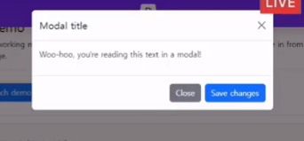

1. 구조/스타일링
2. 레이아웃,배치,공간배분,정렬(position,flexbox)
3. -> 오늘. 파이썬의 라이브러리같이 다른 사람이 만들어 둔 것. Toolkit(Bootstrap)

# Bootstrap

## Bootstrap

css 프론트엔드 프레임워크(Toolkit)

> 미리 만들어진 다양한 디자인 요소들을 제공하여 웹 사이트를 빠르고 쉽게 개발할 수 있도록 함

왜 이 중 Bootstrap? 세계에서 가장 범용적으로 쓰이는 툴킷이기 때문


한글 사이트로 들어가지 마라.

### CDN

- 서버와 사용자 사이의 물리적인 거리를 줄여 콘텐츠 로딩에 소요되는 시간을 최소화(웹페이지 로드 속도를 높임)
- 지리적으로 사용자와 가까운 CDN 서버에 콘텐츠를 저장해서 사용자에게 전달

### Bootstrap 기본 사용법

```html
<p class="mt-5">Hello,World!</p>
```

- mt - 5: 이 이름도 의미가 있다
- {property}{side}-{size} 방식으로 정해짐

< 표현법 >


부트스트랩에는 특정한 규칙이 있는 이름으로 스타일 등이 _미리 작성되어 있음_

그리고 부트스트랩에는 !important가 모두 붙어있음 => 얘가 가장 우선순위가 높다.

### Reset CSS


모든 HTML 스타일을 초기화

> why? 브라우저마다 기본 스타일이 다르다. 브라우저마다 다르게 디자인을 시작할 수 없으니 리셋을 통해 출발점을 똑같이 만들어둔다.

#### Normalize CSS

- 웹 표준 기준으로 브라우저 중 하나가 불일치 한다면 차이가 있는 부분을 수정

## Bootstrap 활용

### Typography

- 제목, 본문텍스트, 목록 등

#### Displat heading

- 눈에 띄는 헤딩이 필요한 경우? Display heading

```html
<h1 class="display-1">Display 1</h1>
<h1 class="display-2">Display 2</h1>
<h1 class="display-3">Display 3</h1>
<h1 class="display-4">Display 4</h1>
<h1 class="display-5">Display 5</h1>
<h1 class="display-6">Display 6</h1>
```

#### Inline text elements

- 인라인 효과들(취소선, 하이라이트 등)을 좀 더 예쁘게

#### colors

> 부트스트랩 쓸 떄 CDN 빼놓으면 적용이 안된다.(head랑 body에 넣는 링크)

##### text - {color}

텍스트의 컬러

##### background color

bg-{color}

```html
<div class="box bg-info border dark"></div>
```

이런 식으로 자손 형태로 클래스가 제작된다.

### Bootstrap Component

부트스트랩에서 제공하는 UI 관련요소(버튼,네비게이션바,카드,폼,드롭다운 등)

```html
<!DOCTYPE html>
<html lang="en">
  <head>
    <meta charset="UTF-8" />
    <meta http-equiv="X-UA-Compatible" content="IE=edge" />
    <meta name="viewport" content="width=device-width, initial-scale=1.0" />
    <link
      href="https://cdn.jsdelivr.net/npm/bootstrap@5.3.3/dist/css/bootstrap.min.css"
      rel="stylesheet"
      integrity="sha384-QWTKZyjpPEjISv5WaRU9OFeRpok6YctnYmDr5pNlyT2bRjXh0JMhjY6hW+ALEwIH"
      crossorigin="anonymous"
    />
    <title>Document</title>
  </head>

  <body>
    <script
      src="https://cdn.jsdelivr.net/npm/bootstrap@5.3.0-alpha1/dist/js/bootstrap.bundle.min.js"
      integrity="sha384-w76AqPfDkMBDXo30jS1Sgez6pr3x5MlQ1ZAGC+nuZB+EYdgRZgiwxhTBTkF7CXvN"
      crossorigin="anonymous"
    ></script>

    <!-- alerts -->
    <div class="alert alert-primary" role="alert">
      A simple primary alert—check it out!
    </div>
    <div class="alert alert-secondary" role="alert">
      A simple secondary alert—check it out!
    </div>
    <div class="alert alert-success" role="alert">
      A simple success alert—check it out!
    </div>
    <div class="alert alert-danger" role="alert">
      A simple danger alert—check it out!
    </div>
    <div class="alert alert-warning" role="alert">
      A simple warning alert—check it out!
    </div>
    <div class="alert alert-info" role="alert">
      A simple info alert—check it out!
    </div>
    <div class="alert alert-light" role="alert">
      A simple light alert—check it out!
    </div>
    <div class="alert alert-dark" role="alert">
      A simple dark alert—check it out!
    </div>

    <!-- badges -->
    <span class="badge text-bg-primary">Primary</span>
    <span class="badge text-bg-secondary">Secondary</span>
    <span class="badge text-bg-success">Success</span>
    <span class="badge text-bg-danger">Danger</span>
    <span class="badge text-bg-warning">Warning</span>
    <span class="badge text-bg-info">Info</span>
    <span class="badge text-bg-light">Light</span>
    <span class="badge text-bg-dark">Dark</span>
    <!-- Buttons -->
    <button type="button" class="btn btn-primary">Primary</button>
    <button type="button" class="btn btn-secondary">Secondary</button>
    <button type="button" class="btn btn-success">Success</button>
    <button type="button" class="btn btn-danger">Danger</button>
    <button type="button" class="btn btn-warning">Warning</button>
    <button type="button" class="btn btn-info">Info</button>
    <button type="button" class="btn btn-light">Light</button>
    <button type="button" class="btn btn-dark">Dark</button>

    <button type="button" class="btn btn-link">Link</button>
    <!-- Cards -->
    <div class="card" style="width: 18rem">
      
      <div class="card-body">
        <p class="card-text">
          Some quick example text to build on the card title and make up the
          bulk of the card's content.
        </p>
      </div>
    </div>
    <!-- navbar -->
    <nav class="navbar navbar-expand-lg bg-body-tertiary">
      <div class="container-fluid">
        <a class="navbar-brand" href="#">Navbar</a>
        <button
          class="navbar-toggler"
          type="button"
          data-bs-toggle="collapse"
          data-bs-target="#navbarSupportedContent"
          aria-controls="navbarSupportedContent"
          aria-expanded="false"
          aria-label="Toggle navigation"
        >
          <span class="navbar-toggler-icon"></span>
        </button>
        <div class="collapse navbar-collapse" id="navbarSupportedContent">
          <ul class="navbar-nav me-auto mb-2 mb-lg-0">
            <li class="nav-item">
              <a class="nav-link active" aria-current="page" href="#">Home</a>
            </li>
            <li class="nav-item">
              <a class="nav-link" href="#">Link</a>
            </li>
            <li class="nav-item dropdown">
              <a
                class="nav-link dropdown-toggle"
                href="#"
                role="button"
                data-bs-toggle="dropdown"
                aria-expanded="false"
              >
                Dropdown
              </a>
              <ul class="dropdown-menu">
                <li><a class="dropdown-item" href="#">Action</a></li>
                <li><a class="dropdown-item" href="#">Another action</a></li>
                <li><hr class="dropdown-divider" /></li>
                <li>
                  <a class="dropdown-item" href="#">Something else here</a>
                </li>
              </ul>
            </li>
            <li class="nav-item">
              <a class="nav-link disabled" aria-disabled="true">Disabled</a>
            </li>
          </ul>
          <form class="d-flex" role="search">
            <input
              class="form-control me-2"
              type="search"
              placeholder="Search"
              aria-label="Search"
            />
            <button class="btn btn-outline-success" type="submit">
              Search
            </button>
          </form>
        </div>
      </div>
    </nav>
  </body>
</html>
```

### 부트스트랩 사용 이유

- 가장 많이 사용되는 css프레임워크
- 사전에 디자인된 다양한 컴포넌트 및 기능
  - 빠른 개발과 유지보수
- 손쉬운 반응형 웹 디자인 구현
- 커스터마이징이 용이
- 크로스 브라우징 지원
  - 모든 주요 브라우저에서 작동하도록 설계되어 있음

### 단점

- 자유도가 상대적으로 떨어짐(직접 만드는것보단)

### Carousel

회전 목마. 컴포넌트 중 하나

```html
<!-- 회전목마 -->

<!DOCTYPE html>
<html lang="en">
  <head>
    <meta charset="UTF-8" />
    <meta http-equiv="X-UA-Compatible" content="IE=edge" />
    <meta name="viewport" content="width=device-width, initial-scale=1.0" />
    <link
      href="https://cdn.jsdelivr.net/npm/bootstrap@5.3.0-alpha1/dist/css/bootstrap.min.css"
      rel="stylesheet"
      integrity="sha384-GLhlTQ8iRABdZLl6O3oVMWSktQOp6b7In1Zl3/Jr59b6EGGoI1aFkw7cmDA6j6gD"
      crossorigin="anonymous"
    />
  </head>

  <body>
    <div class="container"></div>

    <script
      src="https://cdn.jsdelivr.net/npm/bootstrap@5.3.0-alpha1/dist/js/bootstrap.bundle.min.js"
      integrity="sha384-w76AqPfDkMBDXo30jS1Sgez6pr3x5MlQ1ZAGC+nuZB+EYdgRZgiwxhTBTkF7CXvN"
      crossorigin="anonymous"
    ></script>

    <div id="carouselExample" class="carousel slide">
      <div class="carousel-inner">
        <div class="carousel-item active">
          
        </div>
        <div class="carousel-item">
          
        </div>
        <div class="carousel-item">
          
        </div>
      </div>
      <button
        class="carousel-control-prev"
        type="button"
        data-bs-target="#carouselExample"
        data-bs-slide="prev"
      >
        <!--  이 버튼이 어딜 가리키고 있냐가 중요(data-bs-target="#carouselExample",div id="carouselExample" )  -->
        <span class="carousel-control-prev-icon" aria-hidden="true"></span>
        <span class="visually-hidden">Previous</span>
      </button>
      <button
        class="carousel-control-next"
        type="button"
        data-bs-target="#carouselExample"
        data-bs-slide="next"
      >
        <span class="carousel-control-next-icon" aria-hidden="true"></span>
        <span class="visually-hidden">Next</span>
      </button>
    </div>
  </body>
</html>
```

### modal



이런거

Carousel과 원리는 같다. 숨겨져 있던 파일이 누르면 나오는거.

```html
<!DOCTYPE html>
<html lang="en">
  <head>
    <meta charset="UTF-8" />
    <meta http-equiv="X-UA-Compatible" content="IE=edge" />
    <meta name="viewport" content="width=device-width, initial-scale=1.0" />
    <link
      href="https://cdn.jsdelivr.net/npm/bootstrap@5.3.0-alpha1/dist/css/bootstrap.min.css"
      rel="stylesheet"
      integrity="sha384-GLhlTQ8iRABdZLl6O3oVMWSktQOp6b7In1Zl3/Jr59b6EGGoI1aFkw7cmDA6j6gD"
      crossorigin="anonymous"
    />
  </head>

  <body>
    <script
      src="https://cdn.jsdelivr.net/npm/bootstrap@5.3.0-alpha1/dist/js/bootstrap.bundle.min.js"
      integrity="sha384-w76AqPfDkMBDXo30jS1Sgez6pr3x5MlQ1ZAGC+nuZB+EYdgRZgiwxhTBTkF7CXvN"
      crossorigin="anonymous"
    ></script>
    <!-- Button trigger modal -->
    <button
      type="button"
      class="btn btn-primary"
      data-bs-toggle="modal"
      data-bs-target="#exampleModal"
    >
      Launch demo modal
    </button>

    <!-- Modal -->
    <div
      class="modal fade"
      id="exampleModal"
      tabindex="-1"
      aria-labelledby="exampleModalLabel"
      aria-hidden="true"
    >
      <div class="modal-dialog">
        <div class="modal-content">
          <div class="modal-header">
            <h1 class="modal-title fs-5" id="exampleModalLabel">Modal title</h1>
            <button
              type="button"
              class="btn-close"
              data-bs-dismiss="modal"
              aria-label="Close"
            ></button>
          </div>
          <div class="modal-body">...</div>
          <div class="modal-footer">
            <button
              type="button"
              class="btn btn-secondary"
              data-bs-dismiss="modal"
            >
              Close
            </button>
            <button type="button" class="btn btn-primary">Save changes</button>
          </div>
        </div>
      </div>
    </div>
  </body>
</html>
```

얘도 target이 뭔지가 중요. 모달의 id 값과 버튼의 data-bs-target이 올바르게 일치하는지 중요

> modal과 button이 항상 붙어있어야 하나?

상관 없다. 떨어져 있어도 된다. 순서가 바뀌어도 됨. 그래서 보통 모달 코드는 맨 마지막에 올려놓는다.

## Semantic Web

웹 데이터에 구조만 주는게 아니라 의미까지 주는 것


### HTML

ex) <h> </h> != 폰트사이즈 키우는것


의미를 담는다 >> 브라우저마다 정해진 규격으로 들어가게 됨 >> 검색 엔진에도 영향을 미친다. >> SEO(검색 엔진 최적화) : 이게 Semantic Web이 얼마나 잘 되어 있냐에 따라 영향을 받음


나와 있는 애들은 dev랑 완전히 똑같다. 그래도 이름을 바꾸는 이유? 가독성. by 의미부여


### CSS 방법론

#### OOCSS -> 파이썬의 OOP로부터

1. 구조와 스킨을 _분리_
2. 컨테이너와 컨텐츠를 _분리_

3. 구조와 스킨 분리


구조(button)과 스킨(color)을 분리

2. 컨테이너와 콘텐츠 분리

- 객체에 직접 적용하는 대신 객체를 둘러싸는 컨테이너에 스타일을 적용
- 스타일을 정의할 때 위치에 의존적인 스타일을 사용하지 않도록 함
- 콘텐츠를 다른 컨테이너로 이동시키거나 재배치할 때 스타일이 깨지는 것을 방지


### 참고


# off-line

<bootstrap 사용법>

1. bootstrap 공식문서
2. 붙여넣기

> 왜 씀?

이미 짜여진 소스코드기 때문에 우리가 빠르고 쉽게 사용할 수 있다.

<CDN>

분산 컨텐츠 네트워크 Ex)유튜브

왜 쓰냐?

> 물리적인 속도 문제를 해결해준다.
