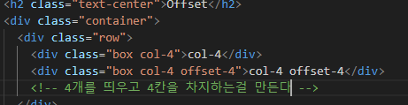
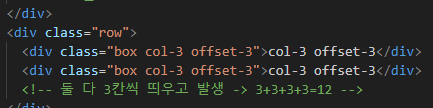
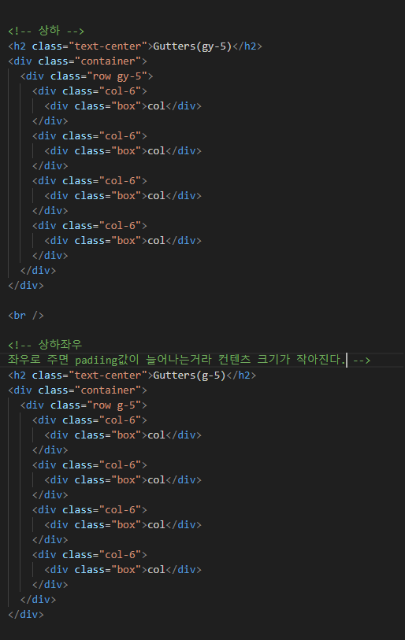

# 팁

#### div>ul>ls\*5

div아래 ul 아래 ls 5개 만드는 것


emmet 검색해서 다큐먼트 보면 나온다.

아니면 emmet cheet sheet 들어가면 나온다.

1. ctrl+l : 한 줄 선택
2. ctrl + d : 동일한 키워드 연속 선택
3. ctrl + alt + 화살표 : 멀티 커서
4. alt + 클릭 : 멀티 커서
5. alt+화살표 : 선택한 라인 끌고 가기
6. alt + shift + 화살표 : 선택한 라인 복사

# Responsive Web

## Bootstrap Grid System

웹 페이지의 *레이아웃을 조정*하는 데 사용되는 *12개의 컬럼*으로 구성된 시스템


일정한 비율들로 나뉘고(전체도 그렇고, 소규모도 그렇고), 일정한 크기를 가진다

> 왜 12개? 약수가 많아서, 1 2 3 4 6 12 -> 숫자가 크기 않은 상태에서 가장 약수가 많다
> -> 레이아웃을 만들 수 있는 여러 케이스가 존재할 수 있기에 12개로 설정

### 반응형 웹 디자인

디바이스 종류나 화면 크기에 상관 없이, 어디서든 일관된 레이아웃 및 사용자 경험을 제공하는 디자인 기술

칸을 기준으로 하기 떄문에 디바이스 크기와 상관이 없음, 결국 *칸을 어떻게 나누느냐*의 싸움.

### Grid System 구조

< 나누기 게임 >

1. container

- column들을 담고 있는 공간

2. column - 실제 컨텐츠를 포함하는 부분
3. gutter - 컬럼과 컬럼 사이 공간


12개 중 4개를 가져가니 3개로 나뉨

container > row > column

> 한 개의 row 안에 12개의 column을 가진다. 이 column들을 어떻게 배치할 것이냐?

<container>


양측에 마진이 생기고 가운데로 정렬된다.

<row>


### Grid System 중첩

그리드 시스템 안에 또 그리드 시스템이 들어갈 수 있다.

 

### 상쇄 (offset)

일부 레이아웃은 비워두는 형태








### gutter

- row에서 지정

> 근데 지금까지 나와있는걸 보면 col끼리 너무 다닥다닥 붙어있다.
> 이걸 해결하려면 gutter가 필요. 그럼 이걸 어떻게 만드냐?


col 끼리는 padding(같은 row), row 끼리는 margin





```html
<!DOCTYPE html>
<html lang="en">
  <head>
    <meta charset="UTF-8" />
    <meta name="viewport" content="width=device-width, initial-scale=1.0" />
    <link
      href="https://cdn.jsdelivr.net/npm/bootstrap@5.3.3/dist/css/bootstrap.min.css"
      rel="stylesheet"
      integrity="sha384-QWTKZyjpPEjISv5WaRU9OFeRpok6YctnYmDr5pNlyT2bRjXh0JMhjY6hW+ALEwIH"
      crossorigin="anonymous"
    />
    <style>
      .box {
        border: 1px solid black;
        background-color: lightblue;
        text-align: center;
      }
    </style>
  </head>

  <body>
    <h2 class="text-center">Basic</h2>
    <div class="container">
      <div class="row">
        <div class="box col">col</div>
        <div class="box col">col</div>
        <div class="box col">col</div>
        <!-- col만 넣어줘도 자동으로 3등분 해주지만, 추천하지 않는다.
        숫자를 넣어주는게 좋음 -->
      </div>
      <div class="row">
        <div class="box col-4">col-4</div>
        <div class="box col-4">col-4</div>
        <div class="box col-4">col-4</div>
      </div>
      <div class="row">
        <div class="box col-2">col-2</div>
        <div class="box col-8">col-8</div>
        <div class="box col-2">col-2</div>
        <!-- 합쳐서 12개 -->
      </div>
    </div>

    <hr />

    <h2 class="text-center">Nesting</h2>
    <div class="container">
      <div class="row">
        <div class="box col-4">col-4</div>
        <div class="box col-8">
          <div class="row">
            <div class="box col-6">col-6</div>
            <div class="box col-6">col-6</div>
            <div class="box col-6">col-6</div>
            <div class="box col-6">col-6</div>
          </div>
        </div>
      </div>
    </div>

    <hr />

    <h2 class="text-center">Offset</h2>
    <div class="container">
      <div class="row">
        <div class="box col-4">col-4</div>
        <div class="box col-4 offset-4">col-4 offset-4</div>
        <!-- 4개를 띄우고 4칸을 차지하는걸 만든다 -->
      </div>
      <div class="row">
        <div class="box col-3 offset-3">col-3 offset-3</div>
        <div class="box col-3 offset-3">col-3 offset-3</div>
        <!-- 둘 다 3칸씩 띄우고 발생 -> 3+3+3+3=12 -->
      </div>
      <div class="row">
        <div class="box col-6 offset-3">col-6 offset-3</div>
        <!-- 가운데에 있는 컨텐츠 -->
      </div>
    </div>

    <hr />

    <h2 class="text-center">Gutters(gx-0)</h2>
    <!-- mx0 같은거 -->
    <div class="container">
      <div class="row gx-0">
        <!-- gutter는 row에서 관리한다 -->
        <div class="col-6">
          <div class="box">col</div>
        </div>
        <div class="col-6">
          <div class="box">col</div>
        </div>
      </div>
    </div>

    <br />

    <!-- 상하 -->
    <h2 class="text-center">Gutters(gy-5)</h2>
    <div class="container">
      <div class="row gy-5">
        <div class="col-6">
          <div class="box">col</div>
        </div>
        <div class="col-6">
          <div class="box">col</div>
        </div>
        <div class="col-6">
          <div class="box">col</div>
        </div>
        <div class="col-6">
          <div class="box">col</div>
        </div>
      </div>
    </div>

    <br />

    <!-- 상하좌우
    좌우로 주면 padiing값이 늘어나는거라 컨텐츠 크기가 작아진다. -->
    <h2 class="text-center">Gutters(g-5)</h2>
    <div class="container">
      <div class="row g-5">
        <div class="col-6">
          <div class="box">col</div>
        </div>
        <div class="col-6">
          <div class="box">col</div>
        </div>
        <div class="col-6">
          <div class="box">col</div>
        </div>
        <div class="col-6">
          <div class="box">col</div>
        </div>
      </div>
    </div>

    <script
      src="https://cdn.jsdelivr.net/npm/bootstrap@5.3.3/dist/js/bootstrap.bundle.min.js"
      integrity="sha384-YvpcrYf0tY3lHB60NNkmXc5s9fDVZLESaAA55NDzOxhy9GkcIdslK1eN7N6jIeHz"
      crossorigin="anonymous"
    ></script>
  </body>
</html>
```

### Grid system breakpoints


다양한 화면 크기에서 적절하게 배치하기 위한 분기점, bootstrap엔 6개가 존재

각 breakpoints마다 설정된 최대 너비 값 _이상으로_ 화면이 커지면 grid system 동작이 변경됨(breakpoint 동작함)

xs가 디폴트

```html
<body>
  <h2 class="text-center">Breakpoints</h2>
  <!-- 
  가장 작을때 -> 한 줄씩 차지
  sm 사이즈일 때 -> 반줄씩 차지
  md 사이즈일 때 -> 한 줄에 2칸 8칸 2칸 + 남은건 한 줄 전부
  lg 사이즈일 때 -> 3칸씩 차지
  xl 사이즈일 때 -> 4칸 4칸 4칸 + 남은건 한 줄 전부
 -->
  <div class="container">
    <div class="row">
      <div class="box col-12 col-sm-6 col-md-2 col-lg-3 col-xl-4">col</div>
      <div class="box col-12 col-sm-6 col-md-8 col-lg-3 col-xl-4">col</div>
      <div class="box col-12 col-sm-6 col-md-2 col-lg-3 col-xl-4">col</div>
      <div class="box col-12 col-sm-6 col-md-12 col-lg-3 col-xl-12">col</div>
      <!-- 너비를 수치로 보려면 개발자도구의 테두리를 붙잡고 칸을 늘리고 줄이면 픽셀값을 볼 수 있다. 다만 화면이 확대되거나 축소되지 않고, 100%(컨트롤 zoom 안 한거)여야 함-->
    </div>
  </div>
</body>
```

#### offset + breakpoint


```html
<h2 class="text-center">Breakpoints + offset</h2>
<!-- 
        첫 번째는 offset이 없다
        sm은 모두 칸 수는 4개씩, 근데 마지막 줄은 가운데에 출력 -> offset-sm-4 : sm일 때 offset 4칸
        md 사이즈는 상쇄되는 부분이 없고, 칸 수만 6칸씩, 기존처럼 col-md-6를 싹 다 박으면 x
        이전 offset이 남아있게 된다. 
        sm-> 특정값 *이상* => md 사이즈에서도 여전히 유지된다. => offset을 md 사이즈에서 다시 0으로 바꿔줘야 한다.
       -->
<div class="row">
  <div class="box col-12 col-sm-4 col-md-6">col</div>
  <div class="box col-12 col-sm-4 col-md-6">col</div>
  <div class="box col-12 col-sm-4 col-md-6">col</div>
  <div class="box col-12 col-sm-4 offset-sm-4 col-md-6 offset-md-0">col</div>
</div>
```

> 주의: 이전 크기에서 offset을 줬으면, 다음 값에서 다시 0으로 만들어줘야함
> 그리고 그리드시스템은 12칸 이하로 주는건 상관 없지만, 넘게 주면 다음 라인으로 넘어가게 된다.

#### +) 다른 기기 웹페이지로 보이게 하는 방법이 있음

### Grid system for Responsive web

그리드 시스템은 화면 크기에 따라 요소를 나누는 것

부트스트랩에서 card를 보면 grid card가 따로 존재한다.

그리드 카드 부분 다시 한 번 들어봐라

```html
<body>
  <h2 class="text-center">Grid Cards</h2>
  <div class="container">
    <!-- 가장 작을 땐 *카드* 1개가 출력
      sm사이즈에선 3개
      md 사이즈에선 2개
    
      칸수 기준이 아닌, 출력되는 *갯수기준*

    offset을 마지막 카드에 주고 싶으면, 걔한테 직접 가서 준다.
    "col offset-sm-4 offset-md-0"-->
    <div class="row row-cols-1 row-cols-sm-3 row-cols-md-2">
      <div class="col">
        <div class="card">
          <div class="card-body">
            <h5 class="card-title">Card title</h5>
            <p class="card-text">
              This is a longer card with supporting text below as a natural
              lead-in to additional content. This content is a little bit
              longer.
            </p>
          </div>
        </div>
      </div>
      <div class="col">
        <div class="card">
          <div class="card-body">
            <h5 class="card-title">Card title</h5>
            <p class="card-text">
              This is a longer card with supporting text below as a natural
              lead-in to additional content. This content is a little bit
              longer.
            </p>
          </div>
        </div>
      </div>
      <div class="col">
        <div class="card">
          <div class="card-body">
            <h5 class="card-title">Card title</h5>
            <p class="card-text">
              This is a longer card with supporting text below as a natural
              lead-in to additional content.
            </p>
          </div>
        </div>
      </div>
      <div class="col offset-sm-4 offset-md-0">
        <div class="card">
          <div class="card-body">
            <h5 class="card-title">Card title</h5>
            <p class="card-text">
              This is a longer card with supporting text below as a natural
              lead-in to additional content. This content is a little bit
              longer.
            </p>
          </div>
        </div>
      </div>
    </div>
  </div>
</body>
```

## CSS Layout 종합 정리

다시 들어라. 재밌음

최신버전 기술이 모든걸 해결해주는건 아님. 모두 적절히 활용해야 함.

mdn을 통해 여러 것을 볼 수 있음

실력을 늘리려면 특정 웹사이트를 최대한 똑같이 만들어보려고 해보면 됨

다만 이 때, 너무 욕심 부려서 네이버 첫 화면 같은거 하지 마라. 컨텐츠가 너무 많음

인스타그램 정도는 굉장히 간단하고, 우리가 배운걸 자연스럽게 만들 수 있다.

이런 스터디는 기한을 짧게 잡아서 하는게 좋다.

web.dev 사이트도 활용

# offline

부트 스트랩 적용 안 하고도 grid system을 적용할 수 있다.

과목평가는 프론트에서만. flexbox 4문제

객관식, 단답형, 서술형

small이 몇 픽셀이고 이런건 안 나옴
